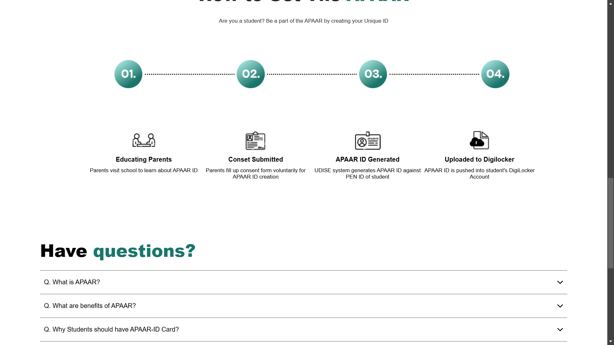

# Cloned Website Project

## Overview
This repository contains a cloned version of an existing website. The purpose of this project is to modify, enhance, or use it for reference.

## Features
- Fully responsive design
- Pre-built pages and components
- Customizable styles and layout

## Technologies Used
- HTML
- CSS
- JavaScript
- Bootstrap (if applicable)
- PHP / MySQL (if backend is included)

## Installation
To run the website locally, follow these steps:

1. Clone the repository:
   ```sh
   git clone https://github.com/your-username/cloned-website.git
   ```
2. Navigate to the project folder:
   ```sh
   cd cloned-website
   ```
3. Open `index.html` in a web browser or use a local server if PHP is used.

## Usage
- Modify HTML/CSS as needed to personalize the site.
- Add or remove sections according to project requirements.
- Ensure all links and paths are correctly configured.

## Adding Screenshots
To add screenshots:
1. Capture screenshots of the website using `PrtSc` or Snipping Tool.
2. Save them in the `screenshots/` folder inside the project.
3. Add them to the README using the following format:
   ```md
   



   ```

## Contribution
If you wish to contribute:
- Fork the repository
- Create a feature branch
- Make necessary changes and submit a pull request

## Contact
For any queries or modifications, contact the project owner or visit the original website source.

---
*This project is a cloned version for reference and customization.*

